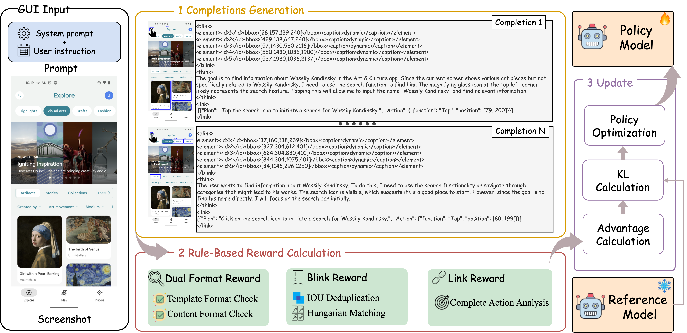
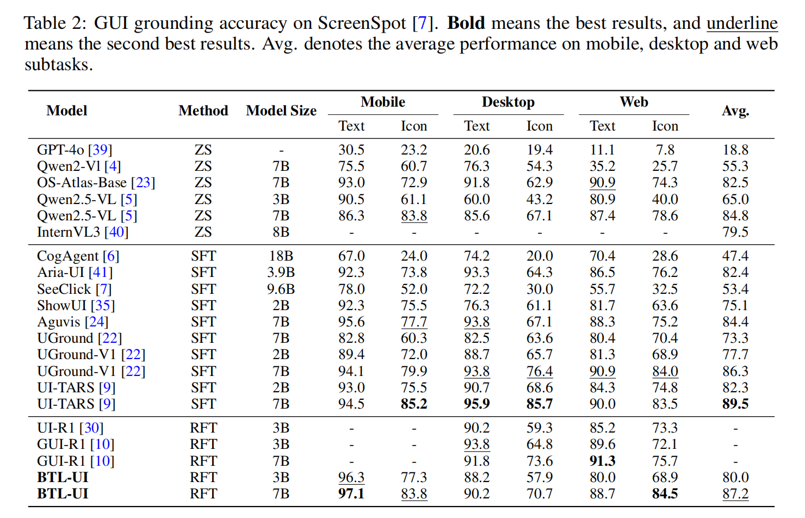
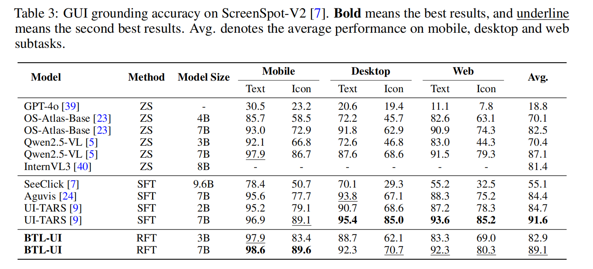
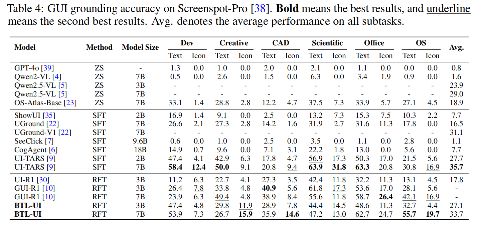
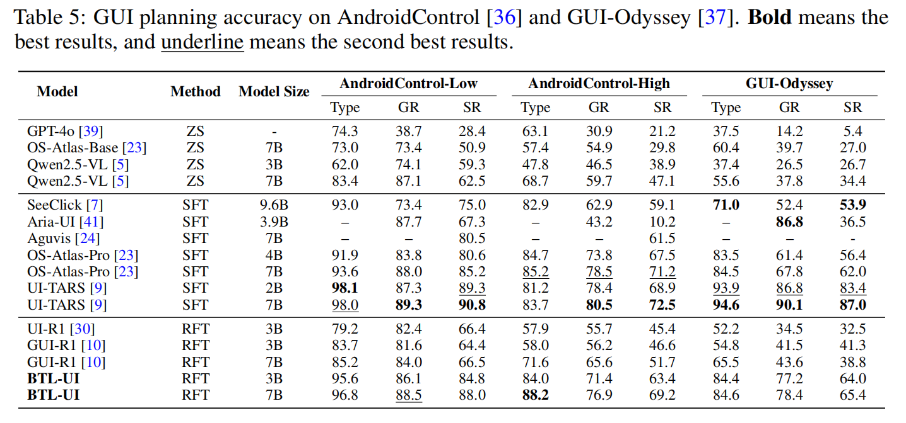

# BTL-UI: Blink-Think-Link Reasoning Model for GUI Agent

<p align="center">
🤗 <a href="https://github.com/xiaomi-research/btl-ui">Blink Data</a> · 🤗 <a href="https://github.com/xiaomi-research/btl-ui">BTL-UI</a> · 📑 <a href="https://arxiv.org/abs/2509.15566">Paper</a> ⭐ <a href="https://github.com/xiaomi-research/btl-ui">GitHub</a>
</p>

## Overview




In the field of AI-driven human-GUI interaction automation, while rapid advances in multimodal large language models and reinforcement fine-tuning techniques have yielded remarkable progress, a fundamental challenge persists: their interaction logic significantly deviates from natural human-GUI communication patterns. To address this gap, we propose Blink–Think–Link (BTL), a brain-inspired framework for human-GUI interaction that mimics the human cognitive process between users and graphical interfaces. The system decomposes interactions into three biologically plausible phases: (1) **Blink** - rapid detection and attention to relevant screen areas, analogous to saccadic eye movements; (2) **Think** - higher-level reasoning and decision-making, mirroring cognitive planning; and (3) **Link** - generation of executable commands for precise motor control, emulating human action selection mechanisms. Additionally, we introduce two key technical innovations for BTL framework: (1) Blink Data Generation - an automated annotation pipeline specifically optimized for blink data, and (2) {BTL Reward – the first rule-based reward mechanism that enables reinforcement learning driven by both process and outcome.}Building upon this framework, we develop a GUI agent model named BTL-UI, which demonstrates competitive performance across both static GUI understanding and dynamic interaction tasks in comprehensive benchmarks. These results provide conclusive empirical validation of the framework's efficacy in developing advanced GUI agents.


## News

🚀 **[2025-11-27]** Our training code is now available on Github.

🚀 **[2025-9-22]** Our paper "BTL-UI: Blink-Think-Link Reasoning Model for GUI Agent" is now available on arXiv.

🚀 **[2025-9-18]** Our paper "BTL-UI: Blink-Think-Link Reasoning Model for GUI Agent" accepted at NeurIPS 2025.


## Evaluation

### ScreenSpot


### ScreenSpot-V2


### ScreenSpot-Pro


### Android-Control & GUI-Odyssey



## Quick Start

### Installation
1. Install ms-swift framework following the [installation](https://github.com/modelscope/ms-swift). We recommend installing [`ms-swift==3.7.0`](https://github.com/modelscope/ms-swift/releases/tag/v3.7.0), so that you can directly start our training script.

2. Manually install the dependencies:
    ```bash
    pip install -r requirements.txt
    ```

### Data preparation

We provide example templates for input formats
- Grounding annotations: `examples/grounding_meta_format.json`
- Navigation annotations: `examples/navigation_meta_format.json`

### Reinforcement Fine-Tuning
```bash
bash recipe/btl-ui/run_3b.sh
bash recipe/btl-ui/run_7b.sh
```

### TODO
- [x] Release Paper
- [x] Release Training Framework
- [ ] Release Training Data
- [ ] Release Full Models

## Acknowledgement
We would like to express our gratitude for the following open-source projects: [ms-swift](https://github.com/modelscope/ms-swift), [Qwen2.5-VL](https://github.com/QwenLM/Qwen3-VL), [vLLM](https://github.com/vllm-project/vllm) and [GUI-R1](https://github.com/ritzz-ai/GUI-R1).

## Citation

Please consider citing this work if you find it helpful.
```bib
@article{zhang2025btl,
  title={Btl-ui: Blink-think-link reasoning model for gui agent},
  author={Zhang Shaojie, and Zhang Ruoceng, and Fu Pei, and Wang Shaokang, and Yang Jiahui, and Du Xin, and Cui Shiqi, and Qin Bin, and Huang Ying, and Luo Zhenbo, and Jian Luan},
  journal={arXiv preprint arXiv:2509.15566},
  year={2025}
}
```